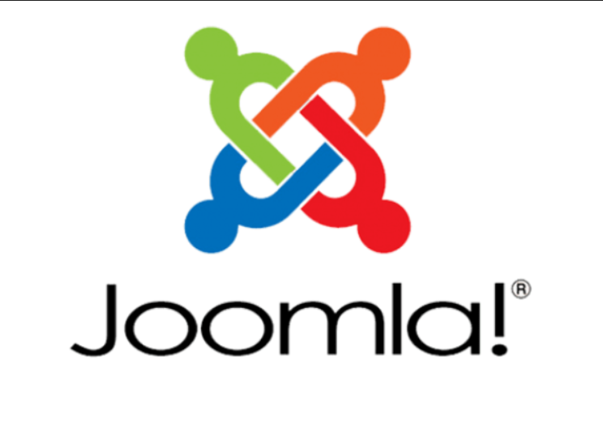
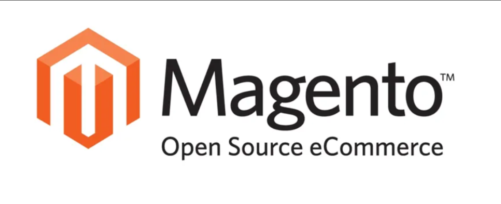
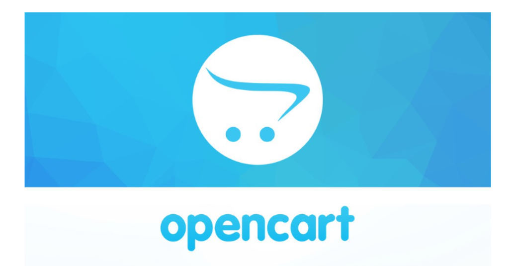

## Mụ lục
- [Mụ lục](#mụ-lục)
- [1. Mã nguồn mở là gì?](#1-mã-nguồn-mở-là-gì)
- [2. Lợi ích của mã nguồn mở](#2-lợi-ích-của-mã-nguồn-mở)
- [3. Ưu điểm của mã nguồn mở](#3-ưu-điểm-của-mã-nguồn-mở)
- [4. Nhược điểm](#4-nhược-điểm)
- [5. Một số mã nguồn mở phổ biến](#5-một-số-mã-nguồn-mở-phổ-biến)
    - [1.1 WordPress](#11-wordpress)
    - [1.2 Joomla](#12-joomla)
    - [1.3 Drupal](#13-drupal)
    - [1.4 Magento](#14-magento)
    - [1.5 OpenCart](#15-opencart)
- [6. Tài liệu tham khảo](#6-tài-liệu-tham-khảo)

## 1. Mã nguồn mở là gì?
- mã nguồn mở là một mô hình phát triển phần mềm mà người ta có thể xem, sửa dổi mvaf phân phối mã nguồn của phần mềm đó mà khppng gặp các hạn chế từ phía bản quyền
## 2. Lợi ích của mã nguồn mở
- Hoàn toàn miễn phí
- Hệ thống mã nguồn hoạt động linh hoạt
- Khả năng bảo mật tuyệt vời
- Cộng đồng hỗ trợ đông đảo
- Không giới hạn khả năng sáng tạo
## 3. Ưu điểm của mã nguồn mở
- Quản lý linh hoạt : cho phép quản lý và điều khiển những phần nào có thể hoạt động linh hoạt.
- Khả năng phát triển : Được thiết kế dưới dạng mở , cho phép nhiều người dùng và lập trình viên tham gia phát triển các tính năng mới.
- Tính bảo mật và an ninh : mã nguồn mở đảm bảo tính bảo mật và an ninh cao hơn so với các phần mềm độc quyền, các lỗi được phát triển và sửa chữa nhanh chóng.
- Ổn định dài hạn : mã nguồn mở giúp hỗ trợ dự án và hoạt đọng của các trang web trong thời gian dài mà không gặp nhiều khó khăn về khả năng nâng cấp hay bảo trì.
## 4. Nhược điểm 
- Tốc độ : Có thể dẫn đến Website trở lên nặng nề và chậm tải do dư thừa code.
- Hỗ trợ hạn chế : có thể khó khăn khi cần phải khắc phục sự cố hoặc thực hiện nâng cấp chắc năng mà không có nguồn hỗ trợ thích hợp.
- Thiếu độc quyền : không tạo ra thiết kế độc quyền cho website, nhiều trang web có thể thiết kế tương tự nhau,làm giảm sự độc đáo và sự phân biệt của mỗi doanh nghiệp.
- Giới hạn trong kinh doanh :  có thể gặp hạn chế trong việc đáp ứng tốt các yêu cầu phức tạp và thích hợp nhiều chức năng đặc biệt.
## 5. Một số mã nguồn mở phổ biến 
##### 1.1 WordPress
- Là một trong những CMS danh giá nhất thị tường hiện nay,thoiwg gian thiết kế nhanh,giao diện quản trị dễ dùng phù hợp với khách hàng.

##### 1.2 Joomla 
- là mã nguồn mở xuất hiện đầu tiên trên internet (2005) được sử dụng nhiều nhất vào các website thương mại điện tử, các designer dễ dàng tùy chỉnh website bán hàng bằng cách thêm các module cho nó, Joomla được viết bằng PHP và có thể sử dụng trong môi trường PHP và mysql.

##### 1.3 Drupal
- là một trong số nhưng mã nguồn mở lớn vẫn còn được hỗ trợ.
- Drupal tách CMS thành 2 phần chính:
\- core : được xây dựng bởi các lập trình viên
\- module : được phát triển bởi cộng đồng. Tại thời điểm này có khoảng 9000 module có thể download.

##### 1.4 Magento
- Là một mã nguồn mở cho phép thiết kế wweb bán hàng rất tốt.
- Mã nguồn Magento được áp dụng rộng rãi bởi các nhà bán lẻ trực tuyrns với khoảng 150.000 trang web.
- Magento hiện phát hành 3 bản khác nhau dùng cho các đối tượng khách hàng bao gồm
\- Magento Comunity Edition : Phiên bản hoàn toàn miễn phí.
Mageto Go : Phiên bản có trả phí hàng tháng, chủ yếu bao gồm dịch vụ Hosting cho website của người sử dụng.
\- Magento Enterprise: Phiên bản chuyên nghiệp tích hợp các tính năng mạnh mẽ nhất cho website "khủng"của các shop bán hàng lớn.

##### 1.5 OpenCart
- Là một mã nguồn mở bán hàng rất gần gũi với phong cách thương mại điện tử ở Việt Nam.
- Sử dụng ngôn ngữ PHP cung cấp các giải pháp thương mại điện tuwrmanhj mẽ với khả năng tạo kinh doanh trực tuyến 
- có thể sửa đổi ,dễ hiệu chỉnh, dễ cải tiến theo hướng phát triển của bản thân người sử dụng.
- Đầu tư khá cung phu cho việc sử dụng, quản lý các gian hàng, và khách hàng, chứa các module cho phép bạn sử dụng các mục đích khác nhau như giới thiệu sản phẩm, sane phẩm được đưa ra trưng bày, liệt kê sản phẩm theo các tính năng.

## 6. Tài liệu tham khảo
- Ưu điểm và nhược điểm [https://vinahost.vn/ma-nguon-mo-la-gi/?gad_source=1gclid=Cj0KCQiAtOmsBhCnARIsAGPa5yatxORl6rVFMwCzGjxQhp6QXRs2yz7toCSrlJb9lqVcCwACO6KEkRsaAgB-EALw_wcB]
- Một số mã nguồn mở phổ biến[https://kb.pavietnam.vn/ma-nguon-mo-la-gi-1-so-ma-nguon-mo-thong-dung.html]
