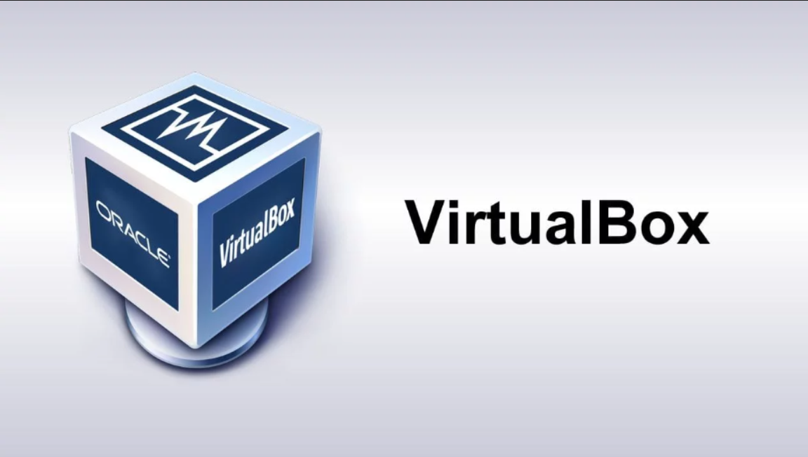
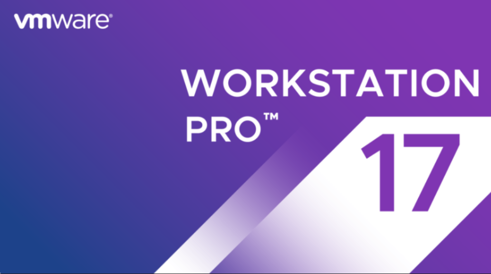
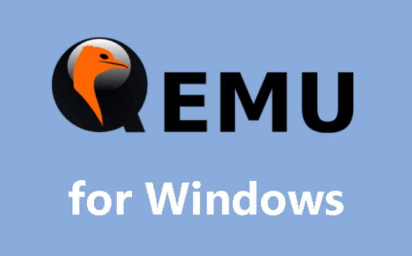
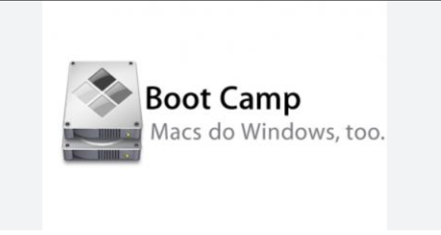

## Mục lục
- [Mục lục](#mục-lục)
- [1. Máy ảo là gì?](#1-máy-ảo-là-gì)
- [2. Ứng dụng của máy ảo](#2-ứng-dụng-của-máy-ảo)
- [3. Lý do nên sử dụng máy ảo?](#3-lý-do-nên-sử-dụng-máy-ảo)
- [4. Một số phần mềm máy ảo tốt nhất hiện nay.](#4-một-số-phần-mềm-máy-ảo-tốt-nhất-hiện-nay)
    - [4.1 Phần mềm Virtual Box](#41-phần-mềm-virtual-box)
    - [4.2 Phần mềm VMware Workstation](#42-phần-mềm-vmware-workstation)
    - [4.3 Phần mềm QEMU](#43-phần-mềm-qemu)
    - [4.4 Boot Camp](#44-boot-camp)
- [5. Tài liệu tham khảo](#5-tài-liệu-tham-khảo)

## 1. Máy ảo là gì?
- Máy ảo là một trình giả lập hệ thống máy tính. Máy ảo sử dụng tài nguyên và chạy trên máy tính thật đồng thời hoạt động riêng biệt hoàn toàn so với hệ thống máy tính thật.
## 2. Ứng dụng của máy ảo
- Kiểm thử phần mềm 
- Tăng cường bảo mật cho máy chủ
- Kiểm tra virus
- Khôi phục hệ thống khi cần 
- Sao chép hệ thống sang máy khác 
- Hỗ trợ chạy phần mềm không tương thích
- Tạo chụp ảnh nhanh
## 3. Lý do nên sử dụng máy ảo?
- Hỗ trợ nhiều môi trường hoạt động
  
\- có thể thiết lập nhiều máy ảo trên máy tính thật.
- Nhanh nhẹn và tốc độ.
  
\- Máy ảo làm cho quá trình chạy các kịch bản thử nghiệm nhanh hơn , hiệu quả hơn.
- Khả nang mở rộng.
  
\- Cho phép người dùng thoải mái mở rộng ứng dụng của mình.

\- Người dùng chỉ cần thêm nhiều máy chủ vật lý hoặc máy ảo hơn để phân khối lượng công việc trên nhiều máy ảo.

\- Giúp người dùng tăng tính khả dụng và hiệu suất của các ứng dụng của mình trở lên phù hợp hơn.
- Tính bảo mật cao.

\- Cho phép người dùng dễ dàng chạy các ứng dụng có vấn đề về độ bảo mật và bảo vệ hệ điều hành máy chủ của mình.
## 4. Một số phần mềm máy ảo tốt nhất hiện nay.
##### 4.1 Phần mềm Virtual Box
\- Là một trong những phền mềm máy ảo được đánh giá tốt nhất hiện nay

\- Sở hữu ưu điểm có thể hỗ trợ đa nên tảng bao gồm nền tảng Windows, macOS và LInus.

\- Không có phiên bản thương mai như nhiều phần mềm máy ảo khác hiện nay.

##### 4.2 Phần mềm VMware Workstation
\- Là phần mềm tạo máy ảo nổi tiếng nhận được nhiều đánh giá tích cực từ phía người dùng, có thể cài đặt trên ác nền tảng Windows, Linux.

\- Tương thích với các phần cứng mới nhất

\- Ưu điểm : là có GUI chất lượng cao,trực quan và cực kì dễ sử dụng

\- Nhược điểm : là có sự khác biệt giữa phiên bản miễn phí và phiên bản mua bản quyền do đó việc thiết lập phần mềm VMware Workstation miễn phí không được đầy đủ các tính năng nâng cao.

##### 4.3 Phần mềm QEMU
\- Là phần mềm máy ảo dược đánh giá cao nhất về chất lượng và giá trị sử dụng.

\- Được dùng nhiều trên hệ điều hành Linux với phiên bản miền phí.

\- Điểm mạnh của phần mềm QEMU là không yêu cầu quản trị viên phải đăng nhập để quản lý và sử dụng.

\- Phần mềm hỗ trợ nhiều tính năng tự động điều chỉnh kích thức của đĩa ảo. 

##### 4.4 Boot Camp
\- Là phần mềm máy ảo được phát triển bởi Apple

\- Phần mềm được cài đặttrên Macbook và được ứng dụng trên hệ điều hành windowws, macOS với phiên bản miễn phí

\- Cho phép người dùng khởi động kép cả 2 hê điều hành một cách hiệu quả là hệ điều hành macOS và Windows.

\- Nhược điểm của phần mềm này là khi mốn di chuyển đổi hệ điều hành thì cần phải khởi động lại máy nếu không thực hiện đúng quy trình đã được quy định thì việc chuyển đổi sẽ thất bại.

## 5. Tài liệu tham khảo
- Ứng dụng của máy ảo [https://maychusaigon.vn/may-ao-la-gi/]
- Một số phần mềm máy ảo tốt nhất hiện nay [https://fptcloud.com/may-ao/]
