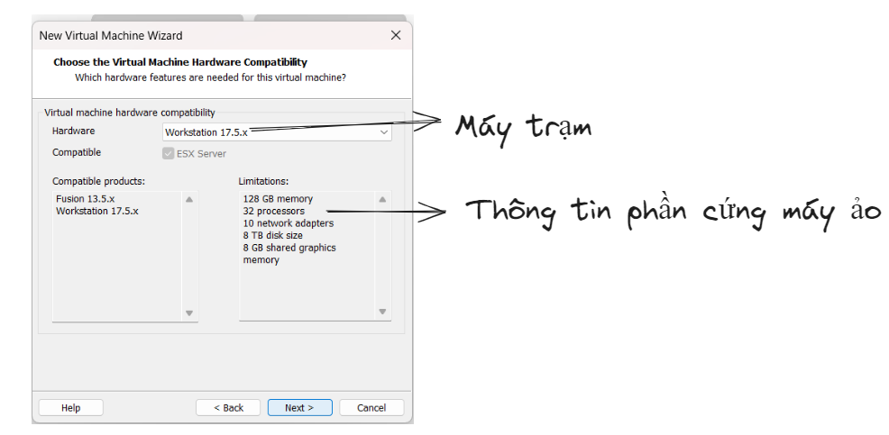

## Mục lục
- [Mục lục](#mục-lục)
- [I.Ubuntu là gì](#iubuntu-là-gì)
- [II. Tính năng của Ubuntu](#ii-tính-năng-của-ubuntu)
- [III. Ưu  điểm của Ubuntu](#iii-ưu--điểm-của-ubuntu)
- [VI. Hướng dẫn cài đặt Ubuntu trên VMware Workstation](#vi-hướng-dẫn-cài-đặt-ubuntu-trên-vmware-workstation)

## I.Ubuntu là gì
- Ubuntu là một hệ điều hành được sử dụng trên máy tính,tạo nên dựa trên công nghệ của Linux/Debian GNU.

## II. Tính năng của Ubuntu
- Thừa hưởng tính năng của Linux
  
  - Là phiên bản hệ điều hành phát triển dựa trên Linux.

  - Có khả năng tùy biến hiệu suất làm việc, tốc độ, cũng như khả năng bảo mật trước sự tấn công của malware hay virus.

- Hỗ trợ cài đặt cho người dùng

  - Người dùng có thể sử dụng đĩa chạy trực tiếp phiên bản đó của hệ điều hành.

  - Người dùng sử dụng Windows có thể phân vùng lại đĩa cứng để cài đặt Ubuntu đồng thời cũng có thể gỡ bỏ nó khá dễ dàngngay cả khi đang sử dụng hệ điều hành Windows.
- Giao diện
  
  - Ubuntu đang sử dụng giao diện đồ hoạ Unity, giao diện này được thiết kế ra với mục đích tối ưu diện tích màn hình sử dụng, cùng đó là trải nghiệm dùng thân thiện.
- Ứng dụng
  
  - Các phần mềm mã nguồn mở được cài sẵn trên hệ điều hành Ubuntu: trình duyệt Internet Firefox, bộ ứng dụng văn phòng đến từ LibreOffice (phiên bản Ubuntu 10.04 trở đi) hay trình tải file torrent Transmission. Hệ điều hành này có một kho các ứng dụng miễn phí có tên là Ubuntu Software Center.
## III. Ưu  điểm của Ubuntu
- Ubuntu hoàn toàn miễn phí
- Hệ điều hành hoàn toàn không có vius
- Mọi phần mềm được auto update 100 %
- Ubuntu bảo vệ dữ liệu quý giá của bạn
- Ít tốn tài nguyên phần cứng 
- Khả năng tương thích cao
- Kho ứng dụng miễn phí khổng lồ
- Chạy được nhiều ứng dụng trên Windows
## VI. Hướng dẫn cài đặt Ubuntu trên VMware Workstation

